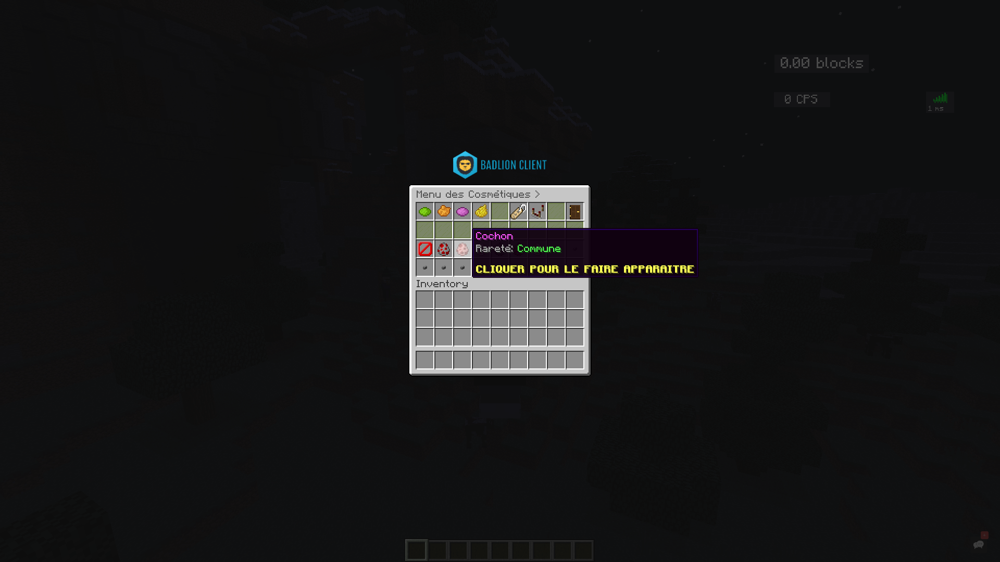
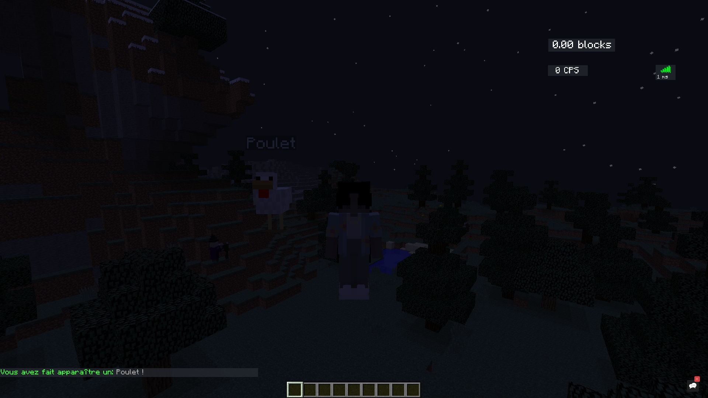

# AmazingPetAPI
This is a *simple API* which allows you to modifiy and have a better control of our plugin **AmazingPet** ([Click here to download the plugin!](https://github.com/Pseudow/AmazingPet)),
available from **1.8** version to **the latest spigot version**! *(Messages are already configurable in config.yml file.)*

# Preview



# Get Started
To begin with, you have to install the plugin in your project to use it.

## Install the plugin
##### Maven
- [x] You just have to add this in your pom.xml:

```html
    <repositories>
        <repository>
            <id>jitpack.io</id>
            <url>https://jitpack.io</url>
        </repository>
    </repositories>

    <dependencies>
        <dependency>
            <groupId>com.github.Pseudow</groupId>
            <artifactId>AmazingPetAPI</artifactId>
            <version>1.0-SNAPSHOT</version>
        </dependency>
    </dependencies>
```

##### Gradle
- [x] You just have to add this in your build.gradle:

```gradle
	allprojects {
		repositories {
			...
			maven { url 'https://jitpack.io' }
		}
	}

        
	dependencies {
	        implementation 'com.github.Pseudow:AmazingPetAPI:1.0-SNAPSHOT'
	}
```

##### Manual
- [x] You can copy and paste all classes in your project or download .jar with [this link]().

## Use it now!
##### Get an instance
Now, you can easily get an instance of this api with:

```
final AmazingPetAPI api = AmazingPetAPI.get();
```

##### Modify command gui
When someone will use the command /amazingpet, a gui will be opened to the command's sender. To
modify this gui you have to create a gui, for example:

```java
private Inventory createInventory(AmazingPetAPI api) {
        Inventory inventory = Bukkit.createInventory(null, 36, api.getConfigMessage("cosmetic-menu"));

        ItemStack background = new ItemBuilder(Material.STAINED_GLASS_PANE).durability((short) 13).displayname("§r").build();

        inventory.setItem(0, new ItemBuilder(Material.INK_SACK).durability((short) 10).displayname(api.getConfigMessage("see-all-pets")).build());
        inventory.setItem(1, new ItemBuilder(Material.INK_SACK).durability((short) 14).displayname(api.getConfigMessage("see-all-pets-except-mine")).build());
        inventory.setItem(2, new ItemBuilder(Material.INK_SACK).durability((short) 13).displayname(api.getConfigMessage("see-only-my-pet")).build());
        inventory.setItem(3, new ItemBuilder(Material.INK_SACK).durability((short) 11).displayname(api.getConfigMessage("dont-see-any-pets")).build());
        inventory.setItem(4, background);
        inventory.setItem(5, new ItemBuilder(Material.NAME_TAG).displayname(api.getConfigMessage("change-pet-name")).build());
        inventory.setItem(6, new ItemBuilder(Material.REDSTONE_COMPARATOR).displayname(api.getConfigMessage("change-animal-flank")).build());
        inventory.setItem(7, background);
        inventory.setItem(8, new ItemBuilder(Material.DARK_OAK_DOOR_ITEM).displayname(api.getConfigMessage("close-menu")).build());

        for (int i = 9; i < 18; i++) {
            inventory.setItem(i, background);
        }

        for (int i = 18; i < 36; i++) {
            inventory.setItem(i, new ItemBuilder(Material.STONE_BUTTON).displayname(api.getConfigMessage("button-message")).build());
        }

        inventory.setItem(18, new ItemBuilder(Material.BARRIER).displayname(api.getConfigMessage("remove-animal")).build());

        int begin = 19;
        for(PetType petType : api.getPetManager().getPetTypes()) {
            inventory.setItem(begin, petType.getIcon());
            begin++;
        }
    }
```

And to replace the old gui by our new gui we just wrote:

```java
api.setGuiOnCommand(createInventory(api));
```

##### Cancel pet's spawn
As bukkit's event, this API contains event that you can also cancel, for example:

```java
public class PetEvents implements Listener {
    @EventHandler
    public void onPetSpawnEvent(PlayerSpawnPetEvent event) {
        event.setCancelled(true);
    }
}
```

But do no't forget to add it in Plugin Manager on enable method in your main class:

```java
Bukkit.getServer().getPluginManager().registerEvents(new PetEvents(), mainClassInstance);
```

Now you can discover the api and use it!
***(I put it here but to be able to create pets and add them in our plugins you have to buy [premium version]().)***

## LICENSE
    This project is a simple API called AmazingPetAPI which allows you to have more control on our plugin AmazingPet.
    Copyright (C) 2020 AmazingPetAPI

    This program is free software; you can redistribute it and/or modify
    it under the terms of the GNU General Public License as published by
    the Free Software Foundation; either version 2 of the License, or
    (at your option) any later version.

    This program is distributed in the hope that it will be useful,
    but WITHOUT ANY WARRANTY; without even the implied warranty of
    MERCHANTABILITY or FITNESS FOR A PARTICULAR PURPOSE.  See the
    GNU General Public License for more details.

    You should have received a copy of the GNU General Public License along
    with this program; if not, write to the Free Software Foundation, Inc.,
    51 Franklin Street, Fifth Floor, Boston, MA 02110-1301 USA.

# AUTHORS
Developped by: **Pseudow** and **Swiiz**.
